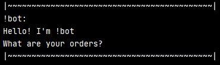
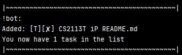
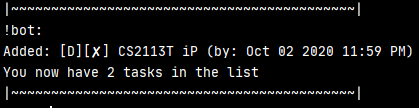
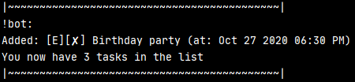
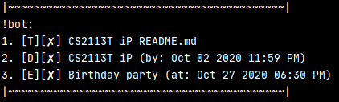
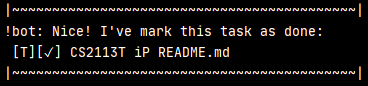
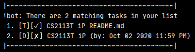
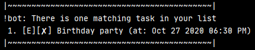
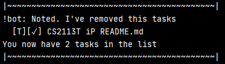
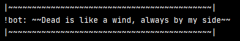

# !bot User Guide

## Table of Contents

[1. Introduction](#1-introduction)  
[2. Quick start](#2-quick-start)  
[3. Features](#3-features)  
&nbsp;&nbsp;&nbsp;&nbsp;[3.1 Adding a task](#31-adding-a-task-todo-deadline-event)  
&nbsp;&nbsp;&nbsp;&nbsp;[3.2 Listing tasks](#32-listing-tasks-list)  
&nbsp;&nbsp;&nbsp;&nbsp;[3.3 Marking task as done](#33-marking-a-task-as-done-done)  
&nbsp;&nbsp;&nbsp;&nbsp;[3.4 Finding tasks by a keyword](#34-finding-tasks-by-a-keyword-find)  
&nbsp;&nbsp;&nbsp;&nbsp;[3.5 Finding tasks on a date](#35-finding-tasks-on-a-date-on)  
&nbsp;&nbsp;&nbsp;&nbsp;[3.6 Deleting a task](#36-deleting-a-task-delete)  
&nbsp;&nbsp;&nbsp;&nbsp;[3.7 Exiting](#37-exiting-bye)  
[4. Command summary](#4-command-summary)
 

## 1. Introduction
!bot is a **command-line (CLI) task list manager program** that helps the absent-minded 
user to track their to-do, deadline and event tasks. !bot can be used by users that can
type fast. !bot can also save your task list to a text file when you exit the program
and load it the next time you enter the program.

## 2. Quick start
1. Ensure that you have `Java 11` or above installed in your computer.
2. Download the iP.jar file by clicking [here](https://github.com/hungvo0603/ip/releases/download/v0.2/iP.jar).
3. Copy the .jar file to your preferable home folder for !bot.
4. Launch the .jar file in the !bot home folder by using `java -jar iP.jar` command on 
Command Prompt (Windows) or on Terminal (MacOS). If the setup is correct, you should see
something like this:

    

## 3. Features
In command syntax, there will be parameters in CAPITAL. Those will be provided by the user.
* DESCRIPTION: a string representing the content of the task.
* DATE: a string representing the date of Deadline and Event tasks. 
The format should be dd/MM/YYYY where
  * `dd` is the day,
  * `MM` is the month,
  * `YYYY` is the year
  * Example: 06/03/2001 represents to 6th Mar 2001.
* TIME: a string representing the time of Deadline and Event tasks.
The format should be HHMM where
  * `HH` is the hour,
  * `MM` is the minute
  * Example: 2300 represents 11:00 PM
* INDEX: an integer representing the index of the task in the list.
* KEYWORD: a string representing the words to be searched in the task list.

### 3.1 Adding a task: `todo`, `deadline`, `event`
Tell !bot to add a new task to its database. There are three types of task you can add:
* **`todo`**: add a to-do to the list
  * Syntax: `todo DESCRIPTION`
  * Example of usage: `todo CS2113T iP README.md`
  * Expected output: 

    
    
* **`deadline`**: add a deadline to the list
  * Syntax: `deadline DESCRIPTION /by DATE TIME`
  * Example of usage: `deadline CS2113T iP /by 02/10/2020 2359`
  * Expected output:
  
    
    
* **`event`**: add an event to the list
  * Syntax: `event DESCRIPTION /at DATE TIME`
  * Example of usage: `event Birthday party /at 27/10/2020 1830`
  * Expected output:
  
    
    
### 3.2 Listing tasks: `list`
List all the tasks that the user has in the list.
* Syntax: `list`
* Expected output:
  
  
  
### 3.3 Marking a task as done: `done`
Mark a task as done when the user has finished the task.
* Syntax: `done INDEX`
* Example of usage: `done 1`
* Expected output:

  

### 3.4 Finding tasks by a keyword: `find`
Find all the tasks which contains a specific keyword.
* Syntax: `find KEYWORD`
* Example of usage: `find CS2113T`
* Expected output:

  

### 3.5 Finding tasks on a date: `on`
Find all the tasks on a specific date.
* Syntax: `on DATE`
* Example of usage: `on 02/10/2020`
* Expected output:

  

### 3.6 Deleting a task: `delete`
Delete a task in a specific index.
* Syntax: `delete INDEX`
* Example of usage: `delete 1`
* Expected output:

  

### 3.7 Exiting: `bye`
Stop !bot and save all the tasks to hard disk.
* Syntax: `bye`
* Expected output:

  

## 4. Command summary
Following is the summary of all available features in !bot program.

Feature | Syntax and Example
------------- | ---------------------------
Add to list | - `todo DESCRIPTION` Example: todo exam  - `deadline DESCRIPTION /by DATE TIME` Example: deadline assignment /by 02/10/2020 2359  - `event DESCRIPTION /at DATE TIME` Example: event party /at 27/10/2020 1900 
List tasks | `list`
Mark as done | `done INDEX` example: done 1
Delete a task | `delete INDEX`
Find tasks by a keyword | `find KEYWORD` example: find CS2113T 
Find tasks on a date | `on DATE` example: on 27/10/2020
Exit | `bye`   

